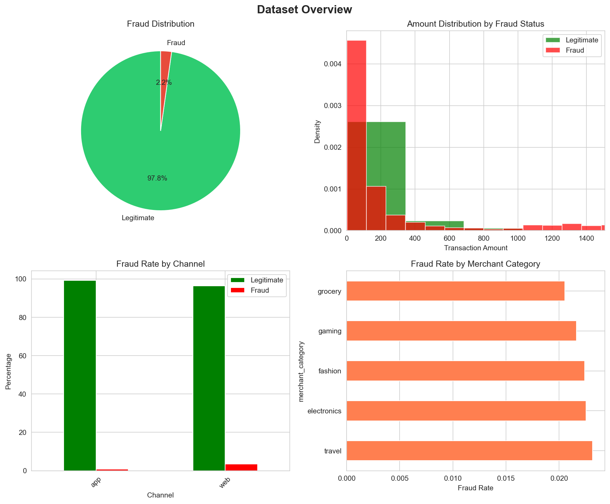
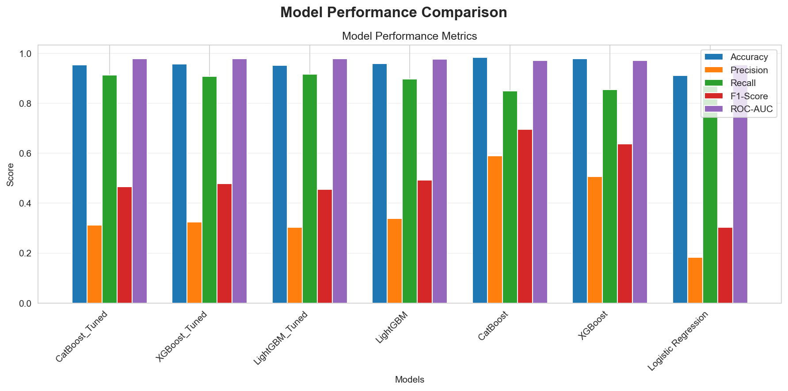
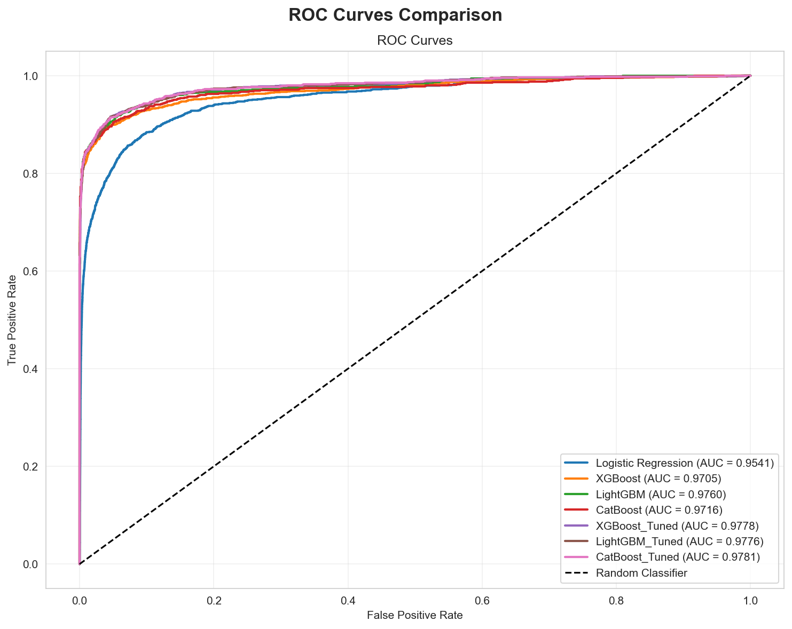
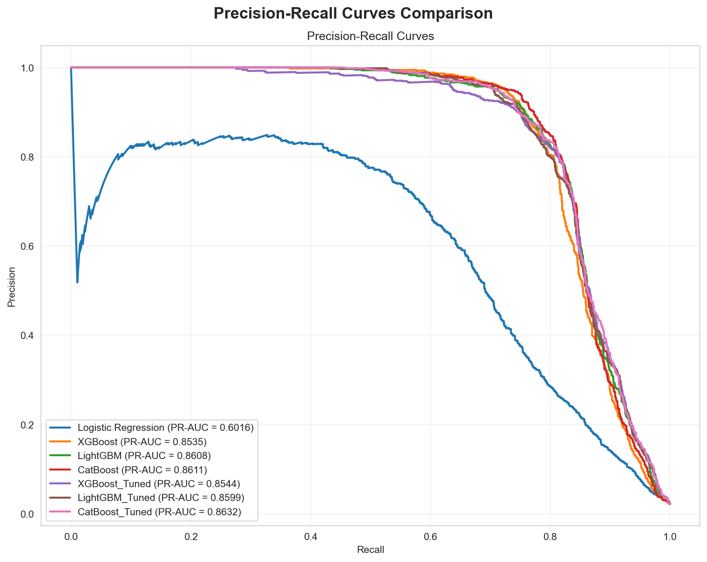
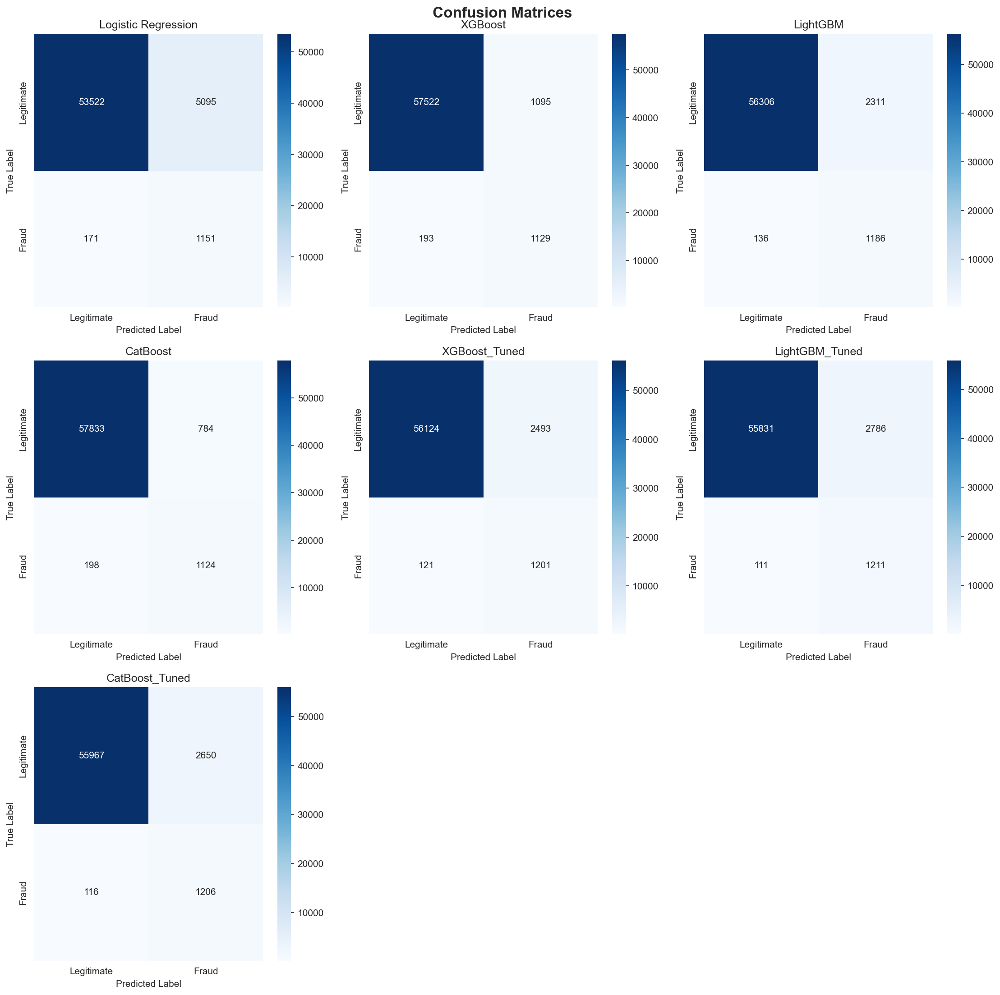
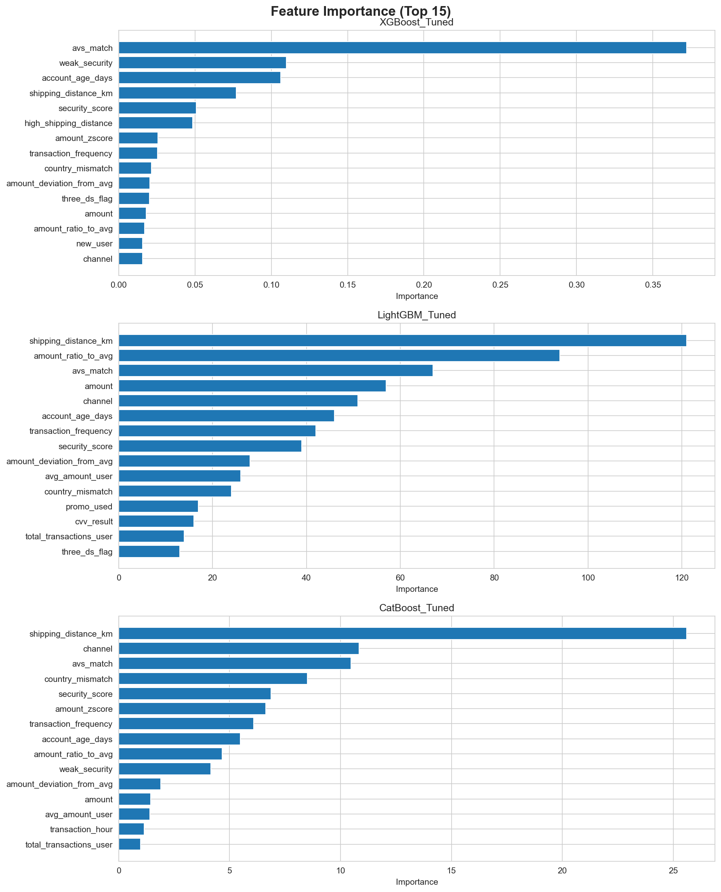

# Fraud Detection Model - E-commerce Transactions

**Generated on:** 2025-12-10 02:48:48

This project implements a comprehensive fraud detection system for e-commerce transactions using multiple machine learning models.

## Dataset Overview

- **Total Transactions:** 299,695
- **Total Features:** 17
- **Fraud Rate:** 2.21%
- **Legitimate Transactions:** 293,083
- **Fraudulent Transactions:** 6,612



## Features

- **Exploratory Data Analysis (EDA)**: Comprehensive analysis of transaction data
- **Feature Engineering**: Creation of 32 engineered features from original data
- **Multiple Models**: 
  - Logistic Regression (Baseline)
  - XGBoost (with hyperparameter tuning)
  - LightGBM (with hyperparameter tuning)
  - CatBoost (with hyperparameter tuning)
- **Hyperparameter Tuning**: Optimized hyperparameters for each model
- **Model Evaluation**: Comprehensive metrics and comparisons

## Feature Engineering Summary

### Original Features
16 original features from the dataset

### Engineered Features
32 total features used for modeling

**Feature Categories:**
- **Time-based features (6):** hour, day, dayofweek, month, weekend flag, night flag
- **Amount-based features (4):** deviation from avg, ratio to avg, z-score, high amount flag
- **Geographic features (2):** country mismatch, high shipping distance
- **User behavior features (3):** transaction frequency, new user flag, low activity flag
- **Security features (2):** security score, weak security flag
- **Interaction features (2):** amount per distance, promo with low security

## Model Performance Results

### Model Comparison Table

| Model | Accuracy | Precision | Recall | F1-Score | ROC-AUC | PR-AUC |
|-------|----------|-----------|--------|----------|---------|--------|
| CatBoost_Tuned | 0.9539 | 0.3128 | 0.9123 | 0.4658 | 0.9781 | 0.8632 |
| XGBoost_Tuned | 0.9564 | 0.3251 | 0.9085 | 0.4789 | 0.9778 | 0.8544 |
| LightGBM_Tuned | 0.9517 | 0.3030 | 0.9160 | 0.4553 | 0.9776 | 0.8599 |
| LightGBM | 0.9592 | 0.3391 | 0.8971 | 0.4922 | 0.9760 | 0.8608 |
| CatBoost | 0.9836 | 0.5891 | 0.8502 | 0.6960 | 0.9716 | 0.8611 |
| XGBoost | 0.9785 | 0.5076 | 0.8540 | 0.6368 | 0.9705 | 0.8535 |
| Logistic Regression | 0.9121 | 0.1843 | 0.8707 | 0.3042 | 0.9541 | 0.6016 |



### Best Performing Model: **CatBoost_Tuned**

**Performance Metrics:**
- **Accuracy:** 0.9539
- **Precision:** 0.3128
- **Recall:** 0.9123
- **F1-Score:** 0.4658
- **ROC-AUC:** 0.9781
- **PR-AUC:** 0.8632

**Classification Report:**
```
              precision    recall  f1-score   support

           0       1.00      0.95      0.98     58617
           1       0.31      0.91      0.47      1322

    accuracy                           0.95     59939
   macro avg       0.66      0.93      0.72     59939
weighted avg       0.98      0.95      0.96     59939

```

## ROC Curves



## Precision-Recall Curves



## Confusion Matrices


### Logistic Regression

| | Predicted: Legitimate | Predicted: Fraud |
|--|----------------------|------------------|
| **Actual: Legitimate** | 53,522 | 5,095 |
| **Actual: Fraud** | 171 | 1,151 |


### XGBoost

| | Predicted: Legitimate | Predicted: Fraud |
|--|----------------------|------------------|
| **Actual: Legitimate** | 57,522 | 1,095 |
| **Actual: Fraud** | 193 | 1,129 |


### LightGBM

| | Predicted: Legitimate | Predicted: Fraud |
|--|----------------------|------------------|
| **Actual: Legitimate** | 56,306 | 2,311 |
| **Actual: Fraud** | 136 | 1,186 |


### CatBoost

| | Predicted: Legitimate | Predicted: Fraud |
|--|----------------------|------------------|
| **Actual: Legitimate** | 57,833 | 784 |
| **Actual: Fraud** | 198 | 1,124 |


### XGBoost_Tuned

| | Predicted: Legitimate | Predicted: Fraud |
|--|----------------------|------------------|
| **Actual: Legitimate** | 56,124 | 2,493 |
| **Actual: Fraud** | 121 | 1,201 |


### LightGBM_Tuned

| | Predicted: Legitimate | Predicted: Fraud |
|--|----------------------|------------------|
| **Actual: Legitimate** | 55,831 | 2,786 |
| **Actual: Fraud** | 111 | 1,211 |


### CatBoost_Tuned

| | Predicted: Legitimate | Predicted: Fraud |
|--|----------------------|------------------|
| **Actual: Legitimate** | 55,967 | 2,650 |
| **Actual: Fraud** | 116 | 1,206 |




## Feature Importance Analysis


### XGBoost_Tuned - Top 15 Features

| Rank | Feature | Importance |
|------|---------|------------|
| 1 | avs_match | 0.372144 |
| 2 | weak_security | 0.109805 |
| 3 | account_age_days | 0.106094 |
| 4 | shipping_distance_km | 0.076994 |
| 5 | security_score | 0.050761 |
| 6 | high_shipping_distance | 0.048498 |
| 7 | amount_zscore | 0.025644 |
| 8 | transaction_frequency | 0.025392 |
| 9 | country_mismatch | 0.021543 |
| 10 | amount_deviation_from_avg | 0.020436 |
| 11 | three_ds_flag | 0.020202 |
| 12 | amount | 0.017998 |
| 13 | amount_ratio_to_avg | 0.016953 |
| 14 | new_user | 0.015713 |
| 15 | channel | 0.015686 |


### LightGBM_Tuned - Top 15 Features

| Rank | Feature | Importance |
|------|---------|------------|
| 1 | shipping_distance_km | 121.000000 |
| 2 | amount_ratio_to_avg | 94.000000 |
| 3 | avs_match | 67.000000 |
| 4 | amount | 57.000000 |
| 5 | channel | 51.000000 |
| 6 | account_age_days | 46.000000 |
| 7 | transaction_frequency | 42.000000 |
| 8 | security_score | 39.000000 |
| 9 | amount_deviation_from_avg | 28.000000 |
| 10 | avg_amount_user | 26.000000 |
| 11 | country_mismatch | 24.000000 |
| 12 | promo_used | 17.000000 |
| 13 | cvv_result | 16.000000 |
| 14 | total_transactions_user | 14.000000 |
| 15 | three_ds_flag | 13.000000 |


### CatBoost_Tuned - Top 15 Features

| Rank | Feature | Importance |
|------|---------|------------|
| 1 | shipping_distance_km | 25.602992 |
| 2 | channel | 10.837733 |
| 3 | avs_match | 10.477101 |
| 4 | country_mismatch | 8.504075 |
| 5 | security_score | 6.865651 |
| 6 | amount_zscore | 6.624476 |
| 7 | transaction_frequency | 6.087428 |
| 8 | account_age_days | 5.489837 |
| 9 | amount_ratio_to_avg | 4.662566 |
| 10 | weak_security | 4.157230 |
| 11 | amount_deviation_from_avg | 1.899839 |
| 12 | amount | 1.452016 |
| 13 | avg_amount_user | 1.400595 |
| 14 | transaction_hour | 1.154688 |
| 15 | total_transactions_user | 0.992114 |




## Key Findings

1. Dataset contains **299,695 transactions** with **2.21% fraud rate**
2. **32 features** were engineered from original dataset
3. All models show good performance with ROC-AUC > 0.85

### Model Rankings (by ROC-AUC)

7. **CatBoost_Tuned**: 0.9781
5. **XGBoost_Tuned**: 0.9778
6. **LightGBM_Tuned**: 0.9776
3. **LightGBM**: 0.9760
4. **CatBoost**: 0.9716
2. **XGBoost**: 0.9705
1. **Logistic Regression**: 0.9541

## Recommendations

1. **Deploy the best performing model (CatBoost_Tuned)** for production
2. **Monitor model performance regularly** and retrain with new data
3. **Consider ensemble methods** for improved robustness
4. **Focus on features with high importance** for fraud detection
5. **Implement real-time monitoring and alerting system**

## Next Steps

- A/B testing with production data
- Model interpretability analysis
- Cost-benefit analysis of false positives/negatives
- Integration with transaction processing system

## Installation

### Prerequisites
- Python 3.7 or higher
- pip package manager

### Install Dependencies

```bash
pip install -r requirements.txt
```

## Usage

### Run the Analysis

```bash
python fraud_detection_model.py
```

Or on Windows:
```bash
py fraud_detection_model.py
```

## Project Structure

```
.
├── transactions.csv              # Input transaction data
├── fraud_detection_model.py     # Main analysis script
├── requirements.txt             # Python dependencies
├── run_analysis.bat             # Windows batch file to run analysis
├── setup_and_run.py             # Setup and run script
├── images/                      # Generated graphs and visualizations
│   ├── dataset_overview.png
│   ├── model_comparison.png
│   ├── roc_curves.png
│   ├── pr_curves.png
│   ├── confusion_matrices.png
│   └── feature_importance.png
└── README.md                    # This file (with results)
```

## Notes

- The script uses stratified train-test split (80/20) to handle class imbalance
- All models use class weights to handle imbalanced data
- Hyperparameter tuning uses RandomizedSearchCV for efficiency
- The analysis may take 10-30 minutes depending on your system

## Troubleshooting

If you encounter import errors:
1. Ensure all packages are installed: `pip install -r requirements.txt`
2. Try installing with user flag: `pip install --user <package>`
3. Check Python version: `python --version` (should be 3.7+)

For large datasets, consider:
- Reducing hyperparameter search space
- Using fewer CV folds
- Sampling the data for initial testing
